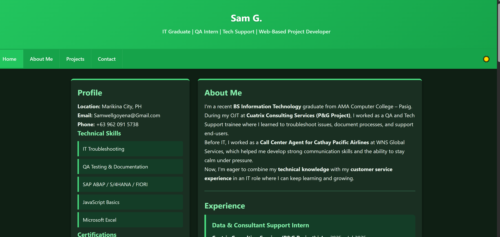

Hi, I'm Sam G.

IT Graduate | QA Intern | Tech Support | Web Developer**

A clean, responsive personal portfolio showcasing my IT journey, projects, and professional experience. Built with pure HTML, CSS, and JavaScript — no frameworks, no backend, just fast and simple.

Live Demo**: [https://sites.google.com/view/hiimsam-aspiringitdeveloper/home](https://sites.google.com/view/hiimsam-aspiringitdeveloper/home)

---

Features

- Dark/Light Mode** with memory (saves preference)
- Fully Responsive** — works on mobile, tablet & desktop
- Scroll-to-Top** button for easy navigation
- Interactive Gallery** — view OJT photos with lightbox
- Resume Download** — view or download PDF instantly
- Assassin Green Theme** — clean, professional, accessible
- Fast Loading** — no heavy frameworks, pure static files

---

Technologies Used

| Category | Tools |
|----------|-------|
| **Frontend** | HTML5, CSS3, JavaScript (ES6+) |
| **Styling** | CSS Variables, Flexbox, Grid, Animations |
| **Icons** | Emoji + Custom Favicon |
| **Hosting** | Static hosting (GitHub Pages, Netlify, or any static host) |
| **Tools** | VS Code, phpMyAdmin (for related projects) |

---

